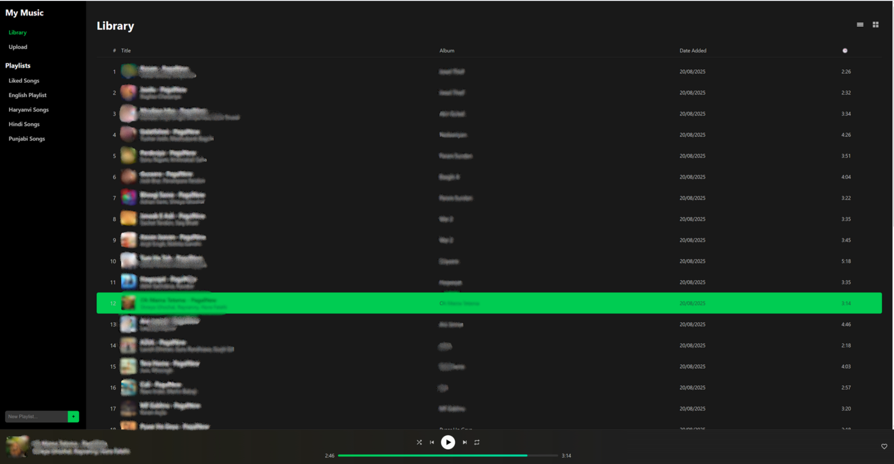

# My Music Cloud (musicfy-app)





A self-hosted music streaming application built with Node.js, Express, and Docker. This application allows you to upload and stream your personal music collection from any device with a web browser.

## Features

-   **Web-Based UI:** Modern, responsive interface that works on both desktop and mobile devices.
-   **Music Library:** Automatically scans your music folder and extracts metadata (title, artist, album, cover art).
-   **File Upload:** Easily upload new music files through the web interface.
-   **Playlist Management:** Create custom playlists and manage your "Liked Songs".
-   **Dynamic Theming:** The player's background color dynamically adapts to the album art of the currently playing song.
-   **Containerized:** Runs entirely within Docker containers for easy setup and portability.

## Prerequisites

Before you begin, ensure you have the following installed on your server or local machine:

-   [Docker](https://docs.docker.com/get-docker/)
-   [Docker Compose](https://docs.docker.com/compose/install/)

## How to Run the Application

Follow these steps to get your music streaming server up and running.

### 1. Clone the Repository

Clone this project from GitHub to your server:

```bash
git clone https://github.com/shivam17171uae/musicfy-app.git

2. Navigate to the Project Directory
code

cd musicfy-app

3. Add Your Music (Important)

The application needs a place to store and read your music files. The .gitignore file is configured to keep this folder private and not upload its contents to GitHub.
Create the music directory inside the project folder:
code

mkdir music
Now, place your .mp3, .flac, .wav, or .ogg files inside this newly created music folder.

4. Build and Start the Application
Use Docker Compose to build the application image and start the container in the background:
code

docker-compose up -d --build
The first time you run this, it will download the necessary base images and build the application, which may take a few minutes.

5. Access Your Music App
Your music server is now running! You can access it by a web browser and navigating to:

http://<your-server-ip>:4029

(Replace <your-server-ip> with the IP address of your server or localhost if you are running it on your local machine).

Stopping the Application
To stop the application container, navigate to the project directory and run:
code

docker-compose down

This will stop and remove the container but will not delete your music files or application data.
---
